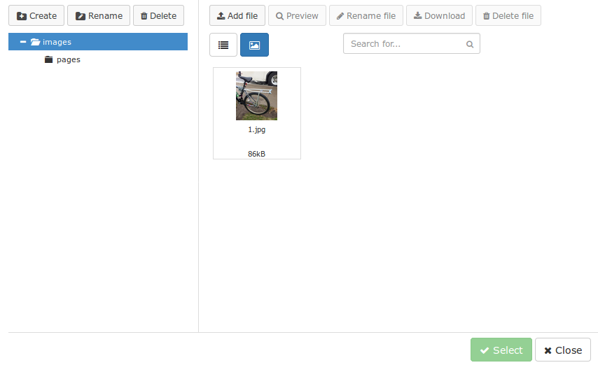

<p align="center">
    <a href="https://github.com/yiisoft" target="_blank">
        
    </a>
    <h1 align="center">Roxy File Manager integration with CKEditor for Yii2</h1>
    <br>
</p>

[](https://packagist.org/packages/nick-denry/yii2-ckeditor-roxyfileman) [](https://packagist.org/packages/nick-denry/yii2-ckeditor-roxyfileman) [](https://packagist.org/packages/nick-denry/yii2-ckeditor-roxyfileman) [](https://packagist.org/packages/nick-denry/yii2-ckeditor-roxyfileman) 

Installation
------------

The preferred way to install this extension is through [composer](http://getcomposer.org/download/).

Either run

```
php composer.phar require --prefer-dist nick-denry/yii2-ckeditor-roxyfileman
```

or add

```
"nick-denry/yii2-ckeditor-roxyfileman": "^0.1.3"
```

to the require section of your `composer.json` file.

Docs
---
*  [Module configuration](docs/module.md)
*  [Integrate to CKEditor](docs/ckeditor.md)
*  [Handle files after upload](docs/events.md)
*  [Overriding](docs/overriding.md)
*  [Standalone](docs/standalone.md)

Screenshot
---


Thanks
---
Project inspired by [navatech/yii2-roxymce](https://github.com/navatech/yii2-roxymce/). Thanks to @phuong17889
